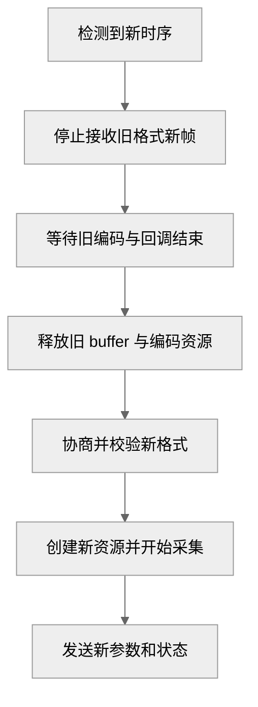

# 支持分辨率变化和动态重建

把 HDMI 源从 1080p 切换到 720p，改变的不只是网页上的宽高文字。**采集 buffer、UV 偏移、编码参数和鼠标坐标映射**都依赖实际图像尺寸。

## 当前固定参数在哪里

`kvm_video_demo/main.cpp` 的 WIDTH/HEIGHT/FPS 固定为 1920/1080/60。采集格式、DMA-BUF 导入布局、回退拷贝长度和编码参数都依赖这些固定尺寸。**驱动模式表包含更多模式，不代表用户态应用已经支持它们**。

| 依赖尺寸的对象 | 改变分辨率时要做什么 |
| --- | --- |
| V4L2 格式 | 停流后重新协商并读回 |
| MMAP buffer 与 DMA-BUF | 等待编码结束，释放编码设备导入映射及导出 fd，再解除采集映射并重新申请 |
| 编码输入内存 | 重新核对导入布局；回退路径按新 stride、对齐和高度重新分配 |
| 编码器 | 按厂商接口要求重建或重配 |
| 输出解码参数 | 确保新 SPS/PPS 与可恢复关键帧到达接收方 |
| 绝对鼠标 | 按新的视频内容区域重新映射 |

## 以一代格式管理一组资源

图 1：一种可实现的分辨率切换流程。

每一代 buffer 必须只对应同一代格式，不能边写新尺寸边沿用旧分配。

跨线程传递图像时可附带格式版本号，拒绝迟到的旧帧。若新格式不支持，应报告明确状态并完成清理，不把 720p 数据填进写死的 1080p 偏移。

## 分开处理帧率和分辨率

相同宽高也可能有不同帧率、扫描方式或色彩属性。重建条件应根据输入时序与接口约束定义，**不能只比较 width/height**。基础实现先限制支持的模式集合，逐项验证后再扩大范围。

**本专题尚未提供完成的动态切换实现**。验收应覆盖 1080p→720p→1080p、同宽高变帧率、不支持模式及切换途中断开客户端，并检查画面、内存、线程和鼠标坐标同时恢复。
