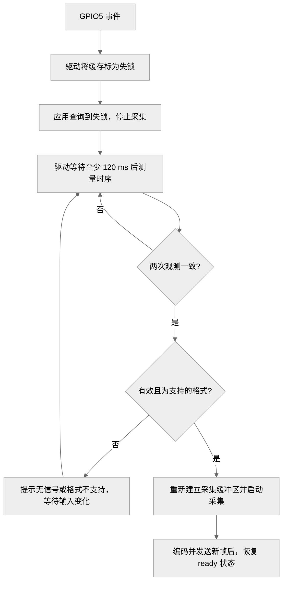

# 修复并实现 HDMI 热插拔

拔掉 HDMI 后，浏览器可能停在最后一帧。**停止更新与正确识别无信号是两件事**：系统还需要提示输入已断开，并在插回后重新采集、编码和显示。

当前实现已在 **1080p60 输入**下验证无 HDMI 软件启动、接回自动恢复及多轮拔插。接线为 **GPIO5 → PE15，RSTN → 3.3V**，具体引脚见[接线与供电检查](../preparation/wiring-firmware.md)。

## 事件通知与视频传输

模块 GPIO5 提供事件通知，MIPI 传输像素。**HDMI 插座 HPD 与 GPIO5 不是同一根线**，不能把 GPIO5 的某个电平直接当作“已有画面”。驱动收到事件后，还要检查有效输入时序。

在 `bsp/drivers/vin/modules/sensor/lt6911c_mipi.c` 中，`sensor_det_irq_func()` 记录待处理事件，并调度延迟工作。PE15 使用双边沿中断，处理前等待 120 ms，以避开插拔过程中的短暂变化。

## 先停止采集，再测量输入时序

**完整时序测量会干扰当前模块的 MIPI 出帧，不能在正常采集中反复执行。** 这类干扰可能表现为局部花屏，同时内核报告 `input lines in one frame is less than execpted, frame lost!`。

当前流程先让应用停止采集，再读取模块时序：



图 1：播放期间的 HDMI 输入变化处理。

`io_lock` 将采集启停与时序测量串行化。`sensor_s_stream()` 记录采集状态；`sensor_det_work()` 在播放期间只更新状态，不测量时序。停止采集后保留至少 120 ms 间隔，让 VIN 完成停止，再进行检测。

`QUERY_DV_TIMINGS` 返回驱动缓存，应用每 250 ms 查询一次不会直接触发寄存器测量。启动时尚未采集，驱动可以直接检测；若漏掉中断，应用在超过 1.5 秒没有新帧时停止并重建采集，让驱动重新确认输入。

## 输入状态与资源恢复

应用的处理位于 `kvm_video_demo/main.cpp` 和 `input_signal.h`。当前视频配置接收 **1920×1080、逐行、约 60 Hz**；热插拔恢复不代表已经支持任意分辨率切换。

| 状态 | 判断依据 | 后续动作 |
| --- | --- | --- |
| `no_lock` | 等待重新确认输入、查询异常，或长时间没有新帧 | 停止采集，等待重新检测 |
| `no_signal` | 驱动确认没有有效输入，返回 `ENOLINK` | 显示无 HDMI 画面提示，等待接入 |
| `out_of_range` | 输入时序超范围或不属于当前支持格式 | 提示格式不支持，等待支持的输入 |
| `ready` | 已成功编码并发送新帧 | 浏览器恢复播放 |

退出一次采集时，统一执行 STREAMOFF、释放 VE 导入资源、解除 MMAP 映射并关闭设备；接回后重建采集并请求 IDR 关键帧。**不能只收到插入事件就发布 ready**，否则网页可能显示已连接，却仍停在旧画面。

## 在板端检查一次拔插

保持网页打开和源设备 1080p60 输出。拔掉 HDMI，等待约 5 秒再插回，全程不刷新页面。板端执行只读检查：

```sh
dmesg | grep -E 'HDMI event|HDMI input|sensor_s_stream|frame lost'
grep -E 'INPUT|Capture thread stopped' /tmp/kvm_video.log
```

实际日志中，一次拔线按下面的顺序发生：

```text
HDMI event: waiting for capture stop before timing probe
sensor_s_stream on=0 result=0
HDMI input unavailable: 60x74@26 error=-67
```

`60x74@26` 是该次断线后模块留下的测量残值，不是有效画面；驱动按无信号处理，`-67` 对应 `ENOLINK`。接回后的日志为：

```text
HDMI input locked: 1920x1080@60 error=0
sensor_s_stream on=1 result=0
```

随后网页应自动恢复持续更新的桌面。正常播放期间，不应周期性出现 `frame lost`；平均帧率接近 60 FPS 也不能代替这项检查。

已完成的短时验证包括无 HDMI 软件重启、接回恢复、多轮拔插，以及时序检测与采集互斥后的连续播放检查。**整机断电冷启动、模块单独断电和长期压力测试仍需单独验证**，不能从普通拔插结果推定通过。
