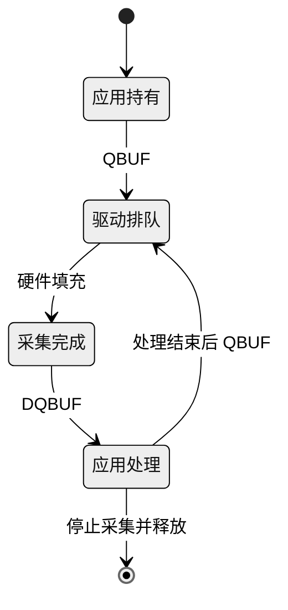

# 连续采集、超时与资源释放

采集第一帧后，如果不把 buffer 重新交回驱动，可用缓冲区最终会耗尽。连续采集的核心不是反复重新打开设备，而是**反复转移缓冲区的使用权**。

## 一个 buffer 的循环



图 1：缓冲区状态。

应用不能保留映射指针给异步消费者后，立即 QBUF 让硬件覆盖它。

## 连续保存一段数据

使用独立采集示例，在设备空闲、输出路径空间足够时运行：

```sh
./v4l2_capture /dev/video0 --capture frames-100.nv12 100
```

100 帧紧密 1080p NV12 约占 311 MB。示例同步写文件，其统计帧率包含存储耗时，因此适合验证连续性，不适合直接作为最大采集性能指标。

程序每次 `poll` 等待设备可读，`DQBUF` 取得有效图像，完成保存后 `QBUF`。非阻塞设备出现 `EAGAIN` 表示本次没有可取 buffer；系统调用被信号中断出现 `EINTR` 时可以重试。其他错误需要记录并退出或进入明确恢复流程。

## sequence 与时间统计

| 信息 | 用来判断什么 |
| --- | --- |
| 成功 DQBUF 次数 | 应用实际拿到多少帧 |
| `sequence` | 帧序号是否连续，结合驱动行为分析丢帧 |
| 单调时钟间隔 | 统计一段采集过程的耗时 |
| timeout 次数 | 是否出现无输入或阻塞 |

**程序配置的 60 fps 是请求值，不是实际成绩**。测量 N 帧通过量时报告统计窗口和是否包含文件写入；比较帧间隔时使用时间戳差或成功出队时刻，避免把启动耗时混进去。

## 失败路径也需要释放

正常退出和中途失败应走到同一个清理入口：已启动则 STREAMOFF，解除所有已建立映射，释放 buffer 队列，关闭输出文件和视频 fd。下载示例用 `streaming` 与已保存的映射状态判断哪些资源确实存在。

当前 `kvm_video_demo/main.cpp` 的 `capture_thread()` 可用于对照整个流程：出队后有限次取走较新的 buffer，归还较旧原始帧，再对最新一帧编码。编码返回后才归还本帧；退出时还需释放编码设备导入映射。教学采集示例用于理解基础 API，不等同于生产程序的完整资源与恢复策略。

## 交给编码器时的生命周期

当前生产程序采用 DMA-BUF 共享时，**必须等同步编码真正消费完成后再归还采集 buffer**；复制回退路径也统一在编码返回后归还。只完成地址传递不代表硬件已读完，所有权和同步必须与数据路径一起设计。

:::tip 连续采集的验收

完成实验后重复启动采集，确认没有 busy、残留进程、持续下降的可用内存或越来越多的 fd。异常输入、超时、手动中断的板端回归仍需单独记录。

:::

<!-- LYNX-LAB:BEGIN -->

## AI 辅助实践闭环

- **稳定步骤**：`t527-kvm-11`
- **学习目标**：理解“连续采集、超时与资源释放”在 T527 Web KVM 链路中的职责，并能用证据解释结果。
- **理解检查**：说明本章输入、输出以及失败时最先检查的证据。
- **学生操作**：在锁定的 Avaota A1 SDK 学习工作区完成“连续采集、超时与资源释放”实验，不直接修改其他板型。
- **工具范围**：`code`
- **风险级别**：`software-safe`
- **预期现象**：命令退出码为 0，并生成带 SHA-256 的结构化证据。

确定性验证：

```bash
cd tutorial-examples/web-kvm
./scripts/run_simulation.sh capture-loop
```

必须保存命令退出码、产物摘要和证据来源；模拟结果只能标记为 `simulation`。完成后回答：解释本章结果为何可信，并指出哪些结论仍需要真实硬件。

<details>
<summary>分级提示</summary>

1. 先确认本章输入、输出与证据来源。
2. 检查 ./scripts/run_simulation.sh capture-loop 的首个失败阶段。
3. 只对当前步骤相关文件做最小修改，并重新生成一次独立 attempt。
4. 参考已签名课程包中的 solution/11，报告标记为 ASSISTED_PASS。

</details>

<!-- LYNX-LAB:END -->
