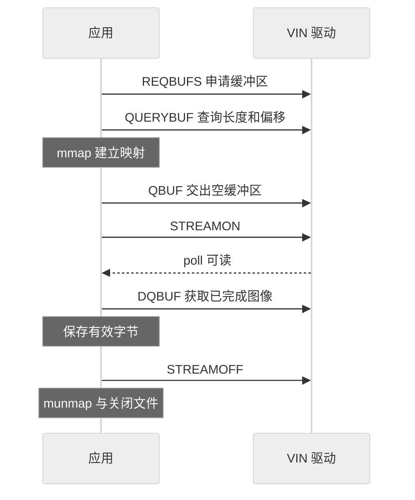

# 用 MMAP 获取并保存第一帧

格式查询告诉应用图像应该怎样保存，却没有产生一帧数据。要获得图像，需要把缓冲区交给驱动，等待采集完成，再把它取回。

## MMAP 与缓冲区所有权

MMAP 将驱动分配的图像内存映射到进程地址空间，应用访问映射地址就能读取数据。**`QBUF` 后该 buffer 交给驱动**，应用不能同时修改它；**`DQBUF` 后应用才能处理本次图像**。接口定义参见 [V4L2 MMAP](https://docs.kernel.org/userspace-api/media/v4l/mmap.html)。



图 1：第一帧的取得过程。

这里的箭头是控制调用，图像由硬件写入缓冲区。

## 从查询示例进入采集

:::warning 独立采集前先释放设备

使用上一章下载并编译的 `v4l2_capture.c`。先停止配套 KVM 服务及其视频子进程，确认 `/dev/video0` 没有其他采集者；保持 HDMI 源输出。不要只关闭网页后就假设进程已经退出。

:::


在板端实验目录执行：

```sh
./v4l2_capture /dev/video0 --capture first-frame.nv12 1
wc -c first-frame.nv12
```

示例请求 1920×1080 NV12、60 fps，并读回实际格式。它只支持单内存平面 NV12，遇到其他格式会拒绝继续，避免把未知布局误写成正常图像。输出文件使用排他创建，已有同名文件时请换文件名。

:::info 示例验证范围

配套 C 文件用于独立采集教学，已进行交叉编译检查。当前运行样机没有为编写文档而中断视频服务，因此本示例的取帧、输出文件与超时路径仍需在空闲板卡上实测；不要把下面的播放条件当作已经获得的截图结果。

:::

## 映射长度从 QUERYBUF 获取

在下载文件的映射循环中，`v4l2_buffer.length = 1` 表示传入一个 plane 描述，而非一字节图像。真正的映射长度是 `plane.length`，偏移是 `plane.m.mem_offset`：

```c
maps[i].ptr = mmap(NULL, plane.length,
    PROT_READ | PROT_WRITE, MAP_SHARED,
    fd, plane.m.mem_offset);
```

每个 buffer 都单独查询，不能把第一个 buffer 的偏移用于所有映射。`mmap` 失败返回 `MAP_FAILED`，不是 NULL。

## 保存有效数据并播放

`DQBUF` 返回的 `index` 指向本次完成的 buffer。**有效数据从 `data_offset` 开始，长度为 `bytesused - data_offset`**。示例检查索引、长度和错误标志后保存，避免把整个分配空间都当成图像。

把文件复制回安装了 FFmpeg 的主机。**仅当实际格式为 1920×1080、行跨度为 1920、没有额外行/尾部填充，且单帧有效长度为 3,110,400 字节时**，按紧密 NV12 播放：

```bash
ffplay -f rawvideo -pixel_format nv12 -video_size 1920x1080 first-frame.nv12
```

存在 padding 时需要依据返回布局逐行导出紧密图像，不能仅修改文件扩展名。**原始 NV12 没有宽高或像素格式文件头**，播放器必须从参数得知这些信息。

| 现象 | 优先检查 |
| --- | --- |
| `S_FMT` / `REQBUFS` 返回 busy | 是否仍有其他进程占用采集设备 |
| 2 秒没有帧 | HDMI 输出、模块状态、MIPI 与 VIN 日志 |
| 能保存但图像错色 | 实际 FourCC、NV12/NV21/UYVY 是否混用 |
| 图像倾斜或错行 | bytesperline、对齐和文件实际长度 |

验收时保存一帧、格式日志和播放截图。下一章让同一组缓冲区循环使用。

<!-- LYNX-LAB:BEGIN -->

## AI 辅助实践闭环

- **稳定步骤**：`t527-kvm-10`
- **学习目标**：理解“用 MMAP 获取并保存第一帧”在 T527 Web KVM 链路中的职责，并能用证据解释结果。
- **理解检查**：说明本章输入、输出以及失败时最先检查的证据。
- **学生操作**：在锁定的 Avaota A1 SDK 学习工作区完成“用 MMAP 获取并保存第一帧”实验，不直接修改其他板型。
- **工具范围**：`code`
- **风险级别**：`software-safe`
- **预期现象**：命令退出码为 0，并生成带 SHA-256 的结构化证据。

确定性验证：

```bash
cd tutorial-examples/web-kvm
./scripts/run_simulation.sh first-frame
```

必须保存命令退出码、产物摘要和证据来源；模拟结果只能标记为 `simulation`。完成后回答：解释本章结果为何可信，并指出哪些结论仍需要真实硬件。

<details>
<summary>分级提示</summary>

1. 先确认本章输入、输出与证据来源。
2. 检查 ./scripts/run_simulation.sh first-frame 的首个失败阶段。
3. 只对当前步骤相关文件做最小修改，并重新生成一次独立 attempt。
4. 参考已签名课程包中的 solution/10，报告标记为 ASSISTED_PASS。

</details>

<!-- LYNX-LAB:END -->
