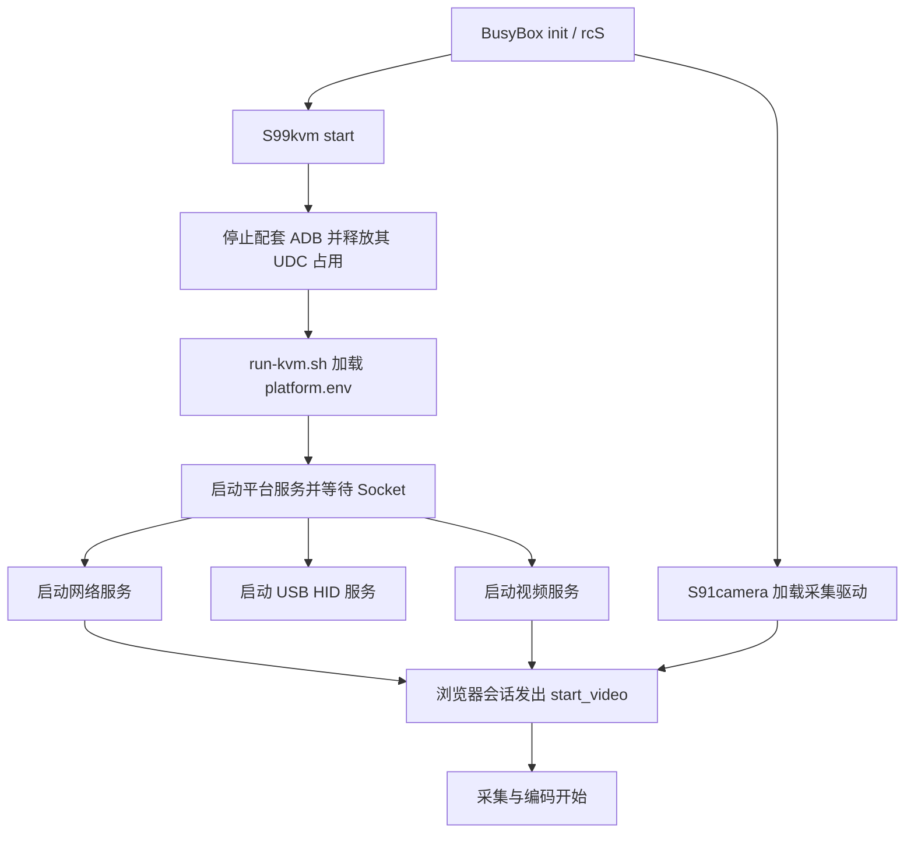

# 组织运行文件并实现开机启动

一次手动运行只能证明当时环境可用。配套系统通过 BusyBox 启动脚本和进程监督组织服务，保证所有设备接口只有一套管理者，并在视频服务退出后重新建立连接。

## 运行目录里的文件分别做什么

当前配套安装目录为 `/userdata/100ask_kvm`，它是本方案的部署约定；更换安装位置时需要同步脚本与配置。

```text
/userdata/100ask_kvm/
├─ bin/
│  ├─ kvm_app        网络服务与内嵌网页
│  ├─ kvm_video      采集与编码
│  ├─ kvm_hid        USB HID 服务
│  ├─ kvm_platform   系统接口与终端
│  └─ kvm-run        进程运行与日志工具
├─ platform.env      UDC、程序和 Socket 路径
├─ board.json        设备节点、系统接口配置
└─ run-kvm.sh        进程监督
```

**`platform.env` 是启动脚本加载的环境配置，`board.json` 由平台服务读取**。前者选择程序和连接端点，后者描述平台可提供的设备和操作；没有配置的外设不能因为页面或源码出现名称就算已经支持。

## 从启动脚本到浏览器视频



图 1：KVM 服务启动流程。

监督脚本管理进程；网络服务管理视频会话。驱动节点与连接实际就绪仍需要检查，不能只看脚本编号。

在板端通过以下入口操作整套服务，不另外运行一份 `run-kvm.sh`：

```sh
/etc/init.d/S99kvm start
# 需要完整停止时执行：
/etc/init.d/S99kvm stop
# 更新后重新启动：
/etc/init.d/S99kvm start
```

:::warning 部署使用独立 SSH 或串口

停止后键鼠、视频和网页终端都会断开。部署时使用独立 SSH 或串口连接，并确认进程已经退出后再替换程序。监督脚本先停视频、网络和 HID，最后停止平台服务；不要只杀掉某个进程再覆盖它，监督脚本可能马上重新拉起。

:::


## 查看配置与运行结果

在板端读取当前配置：

```sh
cat /userdata/100ask_kvm/platform.env
cat /userdata/100ask_kvm/board.json
pidof kvm_app kvm_video kvm_hid kvm_platform
```

| 环境变量 | 当前用途 |
| --- | --- |
| `KVM_USB_UDC` | 选择 USB Device 控制器，本板为 `4100000.udc-controller` |
| `KVM_HID_SOCKET` | 网络服务与 HID 服务共同使用的路径 |
| `KVM_VIDEO_BINARY` | 监督脚本启动的视频程序 |
| `KVM_VIDEO_CTRL_SOCKET`、`KVM_VIDEO_DATA_SOCKET` | 视频控制和数据端点 |
| `KVM_PLATFORM_SOCKET`、`KVM_BOARD_CONFIG` | 平台服务端点及配置文件 |

本板还使用 `KVM_USB_STATE_QUIRK=bound-is-configured` 兼容控制器状态上报。这个兼容值不能证明 USB 物理线已连接，最终仍应观察被控主机枚举和实际输入。

## 部署匹配的产物

在 SDK 根目录构建所需服务，记录 SHA-256，备份板上旧文件；**停止整套服务后，传入新文件并校验**，再替换到安装目录。**前端已经内嵌到 `kvm_app`**，不能只替换网页源码。

修改 SDK 安装内容时同步两处目录：

```text
buildroot/100ask/userdata/100ask_kvm/
out/t527/demo_linux_aiot/buildroot/buildroot/target/userdata/100ask_kvm/
```

前者用于后续构建安装，后者是当前 Buildroot target。同步这些目录不等于已经生成新烧录镜像；完整镜像还需要重新打包与校验。内核、DTB 和 `.ko` 则须按板卡分区及内核版本成套部署。

## 重启后检查哪份日志

```sh
tail -30 /tmp/kvm-supervisor.log
tail -30 /tmp/kvm-app.log
tail -30 /tmp/kvm_video.log
tail -30 /tmp/kvm-hid.log
tail -30 /tmp/kvm-platform.log
```

视频进程存在但没有采集统计时，先打开浏览器建立会话。HID Socket 存在但没有输入时，继续检查 UDC、节点和主机枚举。平台服务失败时检查 `board.json` 与其日志，不通过放开任意设备访问来掩盖配置问题。

完成后进行一次冷启动，确认无需手工命令即可访问网页、播放视频、输入键鼠和打开终端。**热重启服务通过不能代替冷启动验收**。

<!-- LYNX-LAB:BEGIN -->

## AI 辅助实践闭环

- **稳定步骤**：`t527-kvm-22`
- **学习目标**：理解“组织运行文件并实现开机启动”在 T527 Web KVM 链路中的职责，并能用证据解释结果。
- **理解检查**：说明本章输入、输出以及失败时最先检查的证据。
- **学生操作**：在锁定的 Avaota A1 SDK 学习工作区完成“组织运行文件并实现开机启动”实验，不直接修改其他板型。
- **工具范围**：`build`
- **风险级别**：`software-safe`
- **预期现象**：命令退出码为 0，并生成带 SHA-256 的结构化证据。

确定性验证：

```bash
cd tutorial-examples/web-kvm
./scripts/verify_startup.sh
```

必须保存命令退出码、产物摘要和证据来源；模拟结果只能标记为 `simulation`。完成后回答：解释本章结果为何可信，并指出哪些结论仍需要真实硬件。

<details>
<summary>分级提示</summary>

1. 先确认本章输入、输出与证据来源。
2. 检查 ./scripts/verify_startup.sh 的首个失败阶段。
3. 只对当前步骤相关文件做最小修改，并重新生成一次独立 attempt。
4. 参考已签名课程包中的 solution/22，报告标记为 ASSISTED_PASS。

</details>

<!-- LYNX-LAB:END -->
