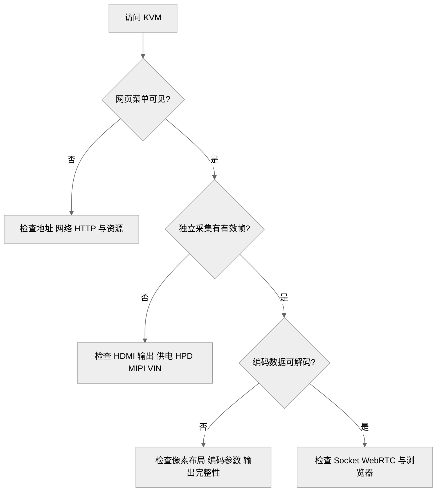

# 按链路定位无画面与无键鼠

同样是“网页没有画面”，可能出在 HDMI 源、模块供电、采集、编码、Socket 或浏览器解码。定位时选择**最靠近数据来源、又能独立观察的检查点**，可以避免反复替换无关软件。

## 从现象选检查点



图 1：视频故障的检查顺序。

独立采集前须停止原采集者，不能让两个实验争抢设备。

| 症状 | 先检查 | 避免的误判 |
| --- | --- | --- |
| 模块 I²C 通信异常 | 模块 VDD_3V3、RSTN、SDA/SCL、共地 | 控制线接通不等于模块供电正常 |
| 有 video0，但持续无帧 | HDMI 实际输出、MIPI 与 VIN | 设备节点不等于信号锁定 |
| 新模块无画面、旧模块正常 | 模块差异、供电、HPD、装配 | 不仅凭晶振不同就改 MCLK |
| 原始帧正常，编码后错色 | NV12 布局、stride、UV 顺序 | 宽高正确不等于布局正确 |
| 编码有输出，网页无画面 | 完整收包、SPS/PPS/IDR、WebRTC 解码 | 菜单正常不证明媒体正常 |
| UDC busy、hidg 缺失 | ADB 等已有 Gadget 绑定 | 停 adbd 不等于解绑 |

## 检查模块主电源与控制线

J3 的复位、I²C 与地不包含模块主电源。遇到模块无响应时，**先在模块端测量 VDD_3V3，再核对共地、复位和 SDA/SCL**。复位脚处于高电平，只能说明该脚的电平状态，不能证明模块主电源正常。

## 实际案例：HPD 电路装配异常

新旧模块使用相同固件，新模块在正常接入时无画面；强制源输出后可以采集，说明至少部分视频链路可工作。随后检查模块 HPD 电路，发现 Q2/Q3 装反，纠正装配后恢复。

“强制输出后可采集”缩小了检查范围，但不能单独证明哪只器件损坏。**最终结论来自电压检查、装配核对与修复后的实际结果**。相同症状的其他模块仍需独立诊断。

## 实际案例：ADB 占用 UDC

KVM 向 `4100000.udc-controller` 绑定时返回 busy，随后无法打开 HID 节点。检查已有 Gadget 的 UDC 占用，比对键盘文件执行 chmod 更接近原因。具体解绑和恢复步骤见[处理 USB 异常](../usb-hid/usb-recovery.md)。

## 保存足够定位问题的记录

```sh
uname -a
ls /dev/video* /dev/hidg* /sys/class/udc
ps | grep -E 'kvm|adbd' | grep -v grep
dmesg | tail -100
tail -100 /tmp/kvm_video.log
```

记录应附复现步骤、模块与固件版本、源设备输出模式、最近修改及首次失败位置。日志中的地址、口令或令牌不应进入公开截图。**不要用最后一条连锁错误代替第一处失败原因**。

<!-- LYNX-LAB:BEGIN -->

## AI 辅助实践闭环

- **稳定步骤**：`t527-kvm-23`
- **学习目标**：理解“按链路定位无画面与无键鼠”在 T527 Web KVM 链路中的职责，并能用证据解释结果。
- **理解检查**：说明本章输入、输出以及失败时最先检查的证据。
- **学生操作**：在锁定的 Avaota A1 SDK 学习工作区完成“按链路定位无画面与无键鼠”实验，不直接修改其他板型。
- **工具范围**：`terminal`
- **风险级别**：`software-safe`
- **预期现象**：命令退出码为 0，并生成带 SHA-256 的结构化证据。

确定性验证：

```bash
cd tutorial-examples/web-kvm
./scripts/run_simulation.sh troubleshooting
```

必须保存命令退出码、产物摘要和证据来源；模拟结果只能标记为 `simulation`。完成后回答：解释本章结果为何可信，并指出哪些结论仍需要真实硬件。

<details>
<summary>分级提示</summary>

1. 先确认本章输入、输出与证据来源。
2. 检查 ./scripts/run_simulation.sh troubleshooting 的首个失败阶段。
3. 只对当前步骤相关文件做最小修改，并重新生成一次独立 attempt。
4. 参考已签名课程包中的 solution/23，报告标记为 ASSISTED_PASS。

</details>

<!-- LYNX-LAB:END -->
