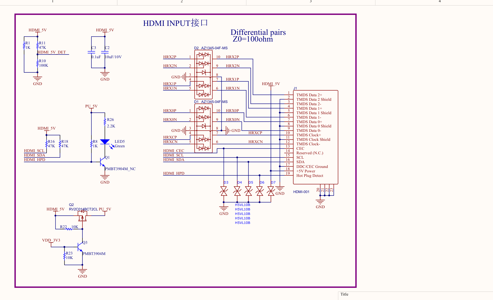
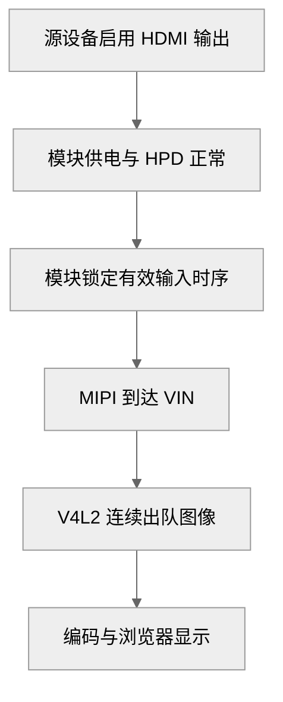

# 判断 HDMI 是否真的有输入

网页有菜单但没有画面时，先确认被控设备真的在输出 HDMI。网页资源来自 Go 服务，桌面像素来自另一条硬件链路，前者正常不能替代后者的检查。

## HDMI 接入包含三类信号

| 信号 | 方向与职责 | 出问题时可能看到什么 |
| --- | --- | --- |
| HDMI 5V | 源设备提供的接口电源相关信号 | 接入检测或模块相关电路状态异常 |
| HPD | 接收端向源设备表示接入状态 | 源设备认为没有显示设备 |
| DDC / EDID | 源设备读取接收端支持的显示模式 | 模式无法识别或选到了不适合的输出 |
| 视频数据 | 源设备向接收端传输像素时序 | 已识别显示设备却没有有效帧 |

EDID 是接收端提供的显示能力数据；HPD 是 HDMI 插座侧信号；模块 GPIO5 是给主板的软件事件输出。**三者有关联，但并不是同一根线**。

## 从源设备确认输出

在源设备显示设置里确认连接状态并启用 1920×1080 输出。若源设备同时有 HDMI IN 和 HDMI OUT，**模块必须接到输出口**。Linux DRM 源设备可先只读查看：

```sh
for d in /sys/class/drm/card*-HDMI-A-*; do
    [ -d "$d" ] || continue
    echo "$d"
    cat "$d/status"
    cat "$d/modes"
done
```

这些命令运行在**被控源设备**，不是 KVM 主板。`connected` 证明连接检测，不单独证明正在传送 1080p 帧。仍需结合桌面设置、当前模式和 KVM 采集结果。

## 模块电源与 HPD 电路

图中重点看 HDMI_5V 到 PU_5V 的 Q2，以及 VDD_3V3 控制的 Q3。它们不是同一种器件。



图 1：HDMI 输入与 HPD 电路。

该板的 Q2 型号为 RV2C014BCT2CL，Q3 为 PMBT3904M。已有调试中出现过两者装反：上游部分节点约 4.7V，但 HPD 相关上拉两端仅约 1V，修正装配后恢复。这个案例说明应沿电源与信号网络逐点定位，不能看到两个模块晶振不同就先修改驱动时钟。

**模块本地晶振与 T527 输出的 MCLK 是不同对象**。配套新模块图纸标为 24MHz，J2 的 CSI_MCLK 标注保留未用；是否匹配固件应检查对应版本资料。

## 从输入状态走到采集结果



图 2：有效图像的检查顺序。

前一层通过，只能使下一层检查有意义，不能跳过中间层。

当前驱动的检测锁初始化存在已知缺口，因此暂不提供未经修复验证的时序查询 ioctl 操作。可先读取已有内核日志，再用后续独立采集实验验证实际帧。输入宽高、像素时钟全零时，不应把应用固定填写的 1920×1080 当成检测结果。

完成本章时保留源设备当前模式、模块供电检查结果和采集情况。若只有强制源设备输出才能采集，应继续定位 HPD/EDID；**强制输出是一项诊断条件，不能替代正常接入验收**。

<!-- LYNX-LAB:BEGIN -->

## AI 辅助实践闭环

- **稳定步骤**：`t527-kvm-08`
- **学习目标**：理解“判断 HDMI 是否真的有输入”在 T527 Web KVM 链路中的职责，并能用证据解释结果。
- **理解检查**：说明本章输入、输出以及失败时最先检查的证据。
- **学生操作**：在锁定的 Avaota A1 SDK 学习工作区完成“判断 HDMI 是否真的有输入”实验，不直接修改其他板型。
- **工具范围**：`terminal`
- **风险级别**：`hardware-confirmation`
- **预期现象**：软件合同通过；接入实机后获得对应设备观测。

确定性验证：

```bash
cd tutorial-examples/web-kvm
./scripts/verify_hdmi_contract.sh
```

必须保存命令退出码、产物摘要和证据来源；模拟结果只能标记为 `simulation`。完成后回答：解释本章结果为何可信，并指出哪些结论仍需要真实硬件。

<details>
<summary>分级提示</summary>

1. 先确认本章输入、输出与证据来源。
2. 检查 ./scripts/verify_hdmi_contract.sh 的首个失败阶段。
3. 只对当前步骤相关文件做最小修改，并重新生成一次独立 attempt。
4. 参考已签名课程包中的 solution/08，报告标记为 ASSISTED_PASS。

</details>

<!-- LYNX-LAB:END -->
