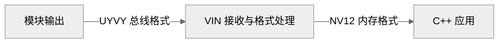

# 适配 LT6911C 子设备驱动

**能找到 `/dev/video0`，不代表 HDMI 输入已锁定**。VIN 主设备负责采集接口，LT6911C 子设备驱动负责模块识别、总线格式、时序及事件，它们共同组成视频通路。

## 驱动如何进入系统

源码位于 `bsp/drivers/vin/modules/sensor/lt6911c_mipi.c`。同目录 `Kconfig` 和 `Makefile` 决定是否构建；当前板级配置使用 `CONFIG_SENSOR_LT6911C=m`，生成可加载模块。

| 符号 | 阅读重点 |
| --- | --- |
| `sensor_probe()` | 分配状态、注册子设备、建立默认格式 |
| `sensor_detect()` | 读取芯片 ID，并与 `0x1605` 比较 |
| `sensor_formats[]` | 媒体总线格式 `MEDIA_BUS_FMT_UYVY8_2X8` |
| `sensor_g_mbus_config()` | CSI-2 D-PHY、四条数据 Lane、虚拟通道 0 |
| `sensor_det_init()` | 供电、复位、GPIO 中断与延迟工作 |
| `sensor_det_exit()` | 取消工作与释放事件资源 |

`sensor_default_regs` 在当前代码中为空。模块内部 HDMI/MIPI 功能由模块内部固件处理；不能把这个 Linux 驱动描述成包含完整模块固件初始化流程。

## 两种图像格式属于不同位置



图 1：媒体总线格式与应用缓冲区格式。

`MEDIA_BUS_FMT_*` 与 `V4L2_PIX_FMT_*` 描述的位置不同。

**驱动宣告 UYVY，应用申请 NV12，并不必然矛盾**。是否能完成这条转换，要由 VIN 支持的格式和实际 `VIDIOC_G_FMT` 返回值确认。

## 固定供电、复位与事件初始化

当前 `sensor_probe()` 在申请 GPIO 和 IRQ 前初始化锁、延迟工作及设备状态，并检查 `sensor_det_init()` 的返回值。初始化失败会返回错误，不会继续把检测功能视为可用。

| 资源 | 当前处理方式 |
| --- | --- |
| 模块供电 | 固定供电时允许省略供电 GPIO；配置了 GPIO 时检查申请结果 |
| RSTN | 固定接 3.3V；`reset_tied_high=1` 时跳过复位 GPIO 操作 |
| GPIO5 | 接 PE15，申请上升沿与下降沿中断，延迟 120 ms 处理事件 |
| 退出清理 | 先停止事件来源、释放 IRQ，再取消工作并释放已申请的 GPIO |

**GPIO5 通知输入可能发生变化，不直接代表有无有效画面。** 驱动在停止采集后读取时序，连续两次观测一致才发布变化；应用查询时读取缓存。播放中不执行完整时序测量，避免测量过程干扰 MIPI 出帧。

## 芯片 ID 与输入时序分别检查

`sensor_detect()` 每轮重新读取芯片 ID，检查 I²C 返回值；匹配 `0x1605` 才返回成功，读取失败或重试耗尽返回负错误码。芯片识别成功只证明控制通路可用，不能代替 HDMI 输入检测。

当前模块使用 24 MHz 晶振。驱动根据参考时钟换算输入时序；本机 1080p60 输入测得像素时钟约 148.494 MHz。晶振配置不匹配会使检测帧率偏离源设备的实际输出。

## 板端验证

```sh
lsmod | grep -E 'lt6911|vin'
dmesg | grep -Ei 'lt6911|sensor_detect|vin|mipi'
ls -l /dev/video0
```

先阅读已有日志；不要在采集过程中直接卸载 VIN 或接收驱动。模块 ID、有效输入时序和实际采集帧需要分开记录。下一章从 HDMI 源设备到输入状态逐级检查。

<!-- LYNX-LAB:BEGIN -->

## AI 辅助实践闭环

- **稳定步骤**：`t527-kvm-07`
- **学习目标**：理解“适配 LT6911C 子设备驱动”在 T527 Web KVM 链路中的职责，并能用证据解释结果。
- **理解检查**：说明本章输入、输出以及失败时最先检查的证据。
- **学生操作**：在锁定的 Avaota A1 SDK 学习工作区完成“适配 LT6911C 子设备驱动”实验，不直接修改其他板型。
- **工具范围**：`code`
- **风险级别**：`software-safe`
- **预期现象**：命令退出码为 0，并生成带 SHA-256 的结构化证据。

确定性验证：

```bash
cd tutorial-examples/web-kvm
./scripts/verify_driver.sh
```

必须保存命令退出码、产物摘要和证据来源；模拟结果只能标记为 `simulation`。完成后回答：解释本章结果为何可信，并指出哪些结论仍需要真实硬件。

<details>
<summary>分级提示</summary>

1. 先确认本章输入、输出与证据来源。
2. 检查 ./scripts/verify_driver.sh 的首个失败阶段。
3. 只对当前步骤相关文件做最小修改，并重新生成一次独立 attempt。
4. 参考已签名课程包中的 solution/07，报告标记为 ASSISTED_PASS。

</details>

<!-- LYNX-LAB:END -->
