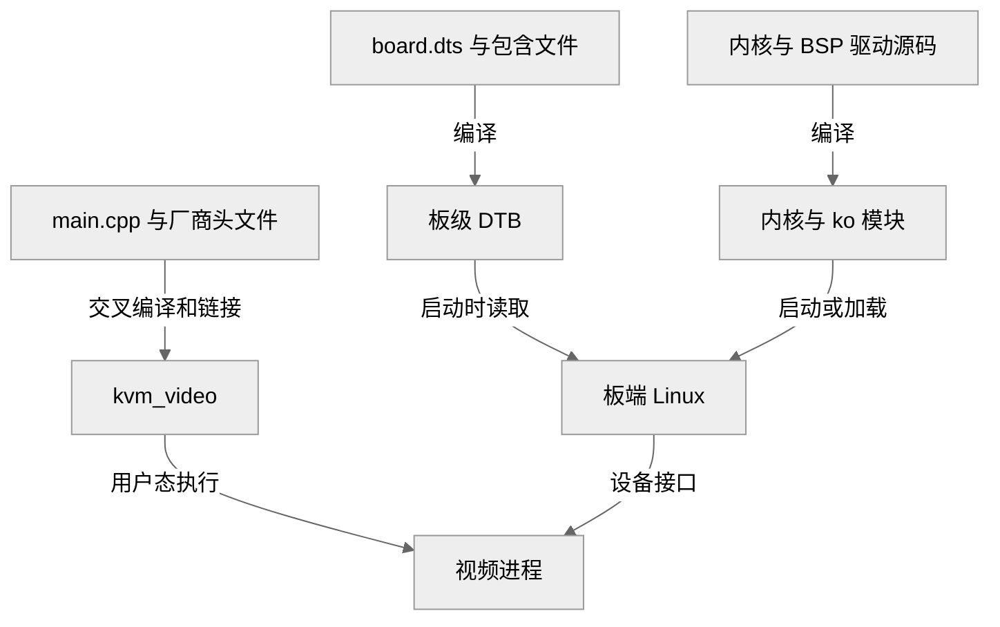

# 构建内核、设备树和应用

设备树和驱动的源文件不会被板端直接读取。Linux 启动时使用编译后的 DTB，内核加载 `.ko` 或内建驱动；改了源码却沿用旧产物，是“修改没有效果”的常见原因。

## 三类产物的去向



图 1：源码、构建产物与板端消费者。

驱动模块还需要匹配内核 ABI，用户态程序需要匹配目标动态库。

## 从 SDK 入口构建

在 SDK 根目录阅读 `build.sh` 和 `build/mkcommon.sh`。当前 `build.sh` 转交给 `mkcommon.sh`，其中 `kernel`、`dtb`、`modules`、`pack` 分别进入对应构建分支。

确认 `.buildconfig` 已选择本板，且已保存修改后，再按需要执行：

```bash
source build/envsetup.sh
./build.sh kernel
./build.sh dtb
```

这两条是当前脚本支持的构建入口，不代表本次文档编写重新完成了全量构建。首次配置或更换板型时，应按配套 SDK 说明使用配置入口，不直接复制其他板的 `.buildconfig`。

查找本次产物：

```bash
find out/t527/demo_linux_aiot -name '*.dtb' -o -name 'lt6911c_mipi.ko'
```

**文件存在可能只是上次构建的结果**。核对**构建退出状态、时间戳、SHA-256**，并反编译目标 DTB 检查本次修改。`pack` 是打包入口，不会因为执行了它就自动证明驱动已重新编译。

## 构建视频应用时消除个人路径

当前 `kvm_video_demo/Makefile` 写有固定 SDK 路径。使用 make 命令行变量覆盖路径，可以先保持源码不变。下面命令在 SDK 根目录执行，假设上一章已设置 `SDK_ROOT` 和 `CROSS_COMPILE`：

```bash
make -C kvm_video_demo \
  CXX="${CROSS_COMPILE}g++" \
  SDK_PATH="$SDK_ROOT/buildroot/package/auto/sdk_lib" \
  KERN_PATH="$SDK_ROOT/kernel/linux-5.15" \
  OUT_PATH="$SDK_ROOT/out/t527/demo_linux_aiot"
```

该目标私有编译 `AWVidoeEncoder.cpp` 并链接厂商底层编码、内存等库；链接错误要看第一个缺失库或符号，不能只复制头文件。Makefile 中虽有 `capture_test`、`capture_simple`、`test_encoder` 目标，当前源码快照缺少它们引用的源文件，因此不要把这些目标当成现成实验。

## 部署前核对版本

| 产物 | 板端消费者 | 核对项目 |
| --- | --- | --- |
| DTB | 启动程序交给内核 | 板型、引脚、设备节点 |
| `.ko` | 同版本 Linux 内核 | `vermagic`、依赖、实际加载路径 |
| `kvm_video` | 监督脚本启动的视频服务 | AArch64、共享库、安装位置 |

只替换应用时，先停止管理它的服务，再备份旧应用、复制新文件并校验。不要一边运行一边覆盖正在执行的文件。DTB 和内核的部署必须按该镜像的分区布局完成，不能猜测分区号。

完成后保留“**源码版本→产物 SHA-256→板端运行版本**”的记录，下一章用 DTB 核对实际引脚配置。

<!-- LYNX-LAB:BEGIN -->

## AI 辅助实践闭环

- **稳定步骤**：`t527-kvm-05`
- **学习目标**：理解“构建内核、设备树和应用”在 T527 Web KVM 链路中的职责，并能用证据解释结果。
- **理解检查**：说明本章输入、输出以及失败时最先检查的证据。
- **学生操作**：在锁定的 Avaota A1 SDK 学习工作区完成“构建内核、设备树和应用”实验，不直接修改其他板型。
- **工具范围**：`build`
- **风险级别**：`software-safe`
- **预期现象**：命令退出码为 0，并生成带 SHA-256 的结构化证据。

确定性验证：

```bash
cd tutorial-examples/web-kvm
./scripts/build_all.sh --check
```

必须保存命令退出码、产物摘要和证据来源；模拟结果只能标记为 `simulation`。完成后回答：解释本章结果为何可信，并指出哪些结论仍需要真实硬件。

<details>
<summary>分级提示</summary>

1. 先确认本章输入、输出与证据来源。
2. 检查 ./scripts/build_all.sh --check 的首个失败阶段。
3. 只对当前步骤相关文件做最小修改，并重新生成一次独立 attempt。
4. 参考已签名课程包中的 solution/05，报告标记为 ASSISTED_PASS。

</details>

<!-- LYNX-LAB:END -->
