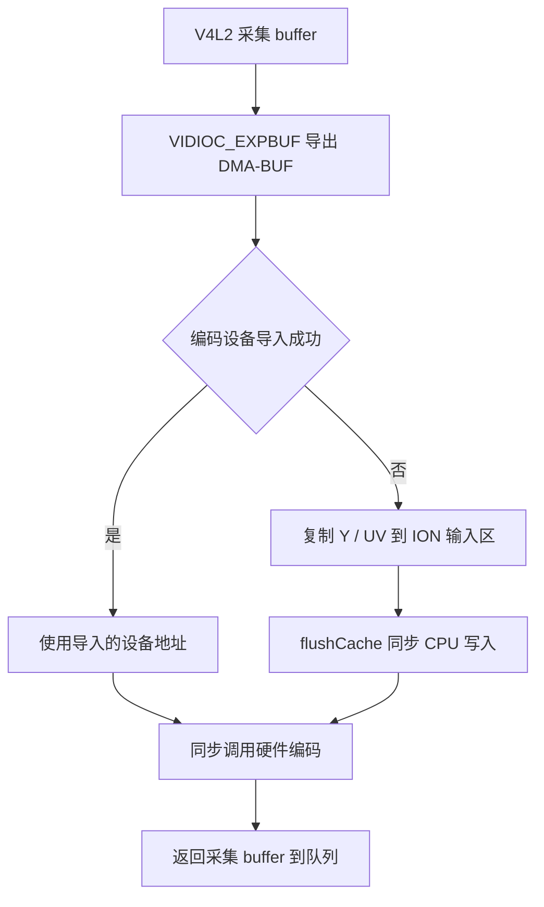

# 把采集缓冲区交给硬件编码器

V4L2 的 MMAP 地址供 CPU 访问，硬件编码器需要的是自己能够访问的设备地址。当前视频服务**优先把采集缓冲区导出并导入编码设备**，避免逐帧复制；**导入失败的缓冲区仍使用 ION 复制路径**。

## 两条输入路径



图 1：采集缓冲区的两条编码路径。

这里省去的是采集到编码之间的图像复制，不代表整个网络链路都没有复制。

在 `kvm_video_demo/main.cpp` 查找 `VIDIOC_EXPBUF`、`g_ve_map_fd`、`imported_buffers` 和 `release_capture_imports()`。导出的 DMA-BUF fd 经 `/dev/cedar_dev` 的平台接口映射，保存成编码器可使用的地址；退出时还要解除映射和关闭导出 fd。

## 编码结束前不能归还采集内存

采集线程 DQBUF 后持有该缓冲区，**直到同步 `encode()` 返回才 QBUF**。若提前归还，采集硬件可能重写编码器尚未读完的画面，产生混帧或随机损坏。

当前选择输入地址的实际代码为：

```cpp
const uintptr_t encoder_addr = imported ? imported : gIonMem.phy;
packet.pAddrPhy0 = (unsigned char*)encoder_addr;
packet.pAddrPhy1 = (unsigned char*)encoder_addr + WIDTH * HEIGHT;
```

这里的地址不是 `malloc()` 指针。Y/UV 偏移采用当前固定 1080p NV12 布局；移植时必须核对格式、步长、平面偏移、容量和设备映射规则，不能仅替换宽高常量。

## 复制回退仍然需要缓存同步

未导入的 buffer 使用 `allocOpen()`、`allocAlloc()` 分配的 ION 区域。CPU 分别复制 Y 和 UV 后执行 `flushCache()`，随后把 `gIonMem.phy` 交给编码器。

| 对象 | 作用 |
| --- | --- |
| `gIonMem.vir` | CPU 写入复制数据的虚拟地址 |
| `gIonMem.phy` | 当前平台编码接口使用的设备地址 |
| `gIonMem.size` | 对齐后的分配容量 |
| `flushCache()` | 同步复制路径的 CPU 写入 |

分配容量是 `ALIGN_16B(WIDTH) * ALIGN_16B(HEIGHT) * 3 / 2`，1080p 下为 3,133,440 字节。**容量包含对齐空间，不代表有效图像尺寸变成 1920×1088**。当前复制按紧密 Y/UV 布局处理，换成不同 stride 的采集设备必须重新适配。

## 用日志确认实际走了哪条路径

在板端执行：

```sh
grep 'VE imported' /tmp/kvm_video.log | tail -3
grep '\[PERF\]' /tmp/kvm_video.log | tail -3
```

本板实测出现：

```text
[PERF] VE imported 3/3 capture buffers, stride=2880 (others use copy)
```

`3/3` 表示三个 buffer 都完成导入，随后统计的 copy/flush 约为 0。这里的 stride 是本驱动返回的字段，不要把 2880 当成通用 NV12 宽度或直接乘入 UV 偏移；应与该平台实际布局和编码接口一起核对。

输出回调中的码流由编码库管理。回调返回后库可复用该空间，因此发送或保存必须在有效期内完成，不能把裸指针交给另一个线程后立即返回。

本章完成后，记录导入数量、输入布局和 buffer 归还时机，再进入编码参数与码流保存。
