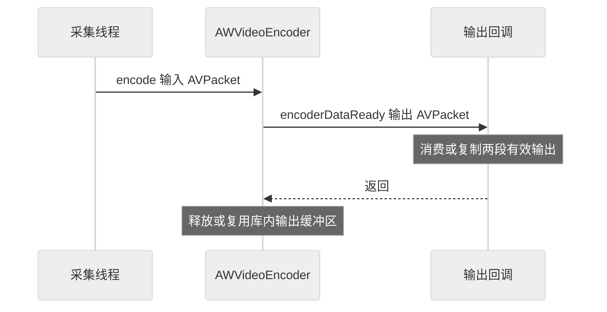

# 编写 HDMI 转 H.264 文件程序

原始 NV12 每帧约 3 MB，直接发送会产生很大的带宽压力。H.264 编码利用图像内部和帧间的重复信息生成压缩码流，浏览器最终收到的是码流，而非原始像素数组。

## 找到编码接口

头文件位于 `buildroot/package/auto/sdk_lib/include/AWVideoEncoder.h`，当前应用在 `init_encoder()` 中创建对象、填充 `EncodeParam` 并注册回调。

| 参数 | 当前源码值 / 含义 |
| --- | --- |
| `codecType` | `CODEC_H264` |
| `pixelFormat` | `PIXEL_YUV420SP`，需与 NV12 输入保持一致 |
| `srcW/srcH`、`dstW/dstH` | 当前均使用 WIDTH/HEIGHT |
| `frameRate` | FPS，当前为 60 |
| `bitRate` | `12000 * 1000`，**12 Mbps，从 kbps 转为 bps** |
| `maxKeyFrame` | 60，源码实际传入值 |
| `rcMode` | VBR，可变码率 |
| `minQp/maxQp` | 20 / 28，量化参数范围 |

关键帧间隔影响新接收者恢复解码和压缩效率；更高压缩通常伴随画质取舍。这里描述当前参数，不把它们宣称为所有桌面内容的最优配置。当前输出使用 **H.264 High / Level 4.2**。私有编译的 SDK 编码封装由视频应用 Makefile 选择级别，生成的 SPS 是核对实际配置的依据。

## 从输入调用到输出回调



图 1：编码输出的有效期。

回调包中的两段数据共同组成一次编码输出。

## 把输出保存为 H.264

当前正式程序将回调数据发送到视频 Socket，并非独立落盘示例。可以在实验分支中将 `EncoderCallback::encoderDataReady()` 的输出目的地改为文件。先按下面的小范围修改，保留原版本：

1. 在进入采集前以二进制模式打开实验文件，并检查失败。
2. 回调中检查 `packet`、长度和指针；**依次完整写入 `pAddrVir0/dataLen0` 与 `pAddrVir1/dataLen1`**。
3. 写入失败应记录错误并停止实验，不能把不完整文件报告成成功。
4. 停止采集、等待回调结束，再关闭文件。

下面仅展示回调中的保存逻辑，`output` 是提前打开的文件，不是一份可独立运行的完整程序：

```cpp
// 两段输出都必须在回调返回前消费，保持编码器给出的顺序。
if (packet->dataLen0 > 0 && packet->pAddrVir0) {
    if (fwrite(packet->pAddrVir0, 1, packet->dataLen0, output)
        != static_cast<size_t>(packet->dataLen0)) return -1;
}
if (packet->dataLen1 > 0 && packet->pAddrVir1) {
    if (fwrite(packet->pAddrVir1, 1, packet->dataLen1, output)
        != static_cast<size_t>(packet->dataLen1)) return -1;
}
```

当前程序启动依赖数据和控制两个本地 Socket，故仅替换回调还不会成为完全独立的编码器实验。要独立运行，还需去掉对 `connect_sockets()` 和 `start_video` 的启动依赖，建立本地启停入口。本文未把这一改造包装成已验证的成品；现阶段可用后面的[视频收包工具](../integration/video-socket.md)检查输出协议。

## Annex-B 与播放

当前视频协议发送 Annex-B H.264，NAL 单元前有 `00 00 01` 或 `00 00 00 01` 起始码。**SPS/PPS 提供解码参数，IDR 帧提供刷新参考状态的入口**。一次回调不应被简单当作“一个 NAL”。

在装有 FFmpeg 的开发主机，对实际保存的文件执行：

```bash
ffprobe -v error -f h264 -show_streams capture.h264
ffplay -f h264 capture.h264
```

检查 codec、宽高、持续播放与画面内容。裸 H.264 不包含本项目采集时间戳，播放器推断的速率不能替代采集端测量。本章还需补齐独立编码示例的实机编译、录制和播放结果。

<!-- LYNX-LAB:BEGIN -->

## AI 辅助实践闭环

- **稳定步骤**：`t527-kvm-13`
- **学习目标**：理解“编写 HDMI 转 H.264 文件程序”在 T527 Web KVM 链路中的职责，并能用证据解释结果。
- **理解检查**：说明本章输入、输出以及失败时最先检查的证据。
- **学生操作**：在锁定的 Avaota A1 SDK 学习工作区完成“编写 HDMI 转 H.264 文件程序”实验，不直接修改其他板型。
- **工具范围**：`build`
- **风险级别**：`software-safe`
- **预期现象**：命令退出码为 0，并生成带 SHA-256 的结构化证据。

确定性验证：

```bash
cd tutorial-examples/web-kvm
./scripts/build_all.sh --arm64
```

必须保存命令退出码、产物摘要和证据来源；模拟结果只能标记为 `simulation`。完成后回答：解释本章结果为何可信，并指出哪些结论仍需要真实硬件。

<details>
<summary>分级提示</summary>

1. 先确认本章输入、输出与证据来源。
2. 检查 ./scripts/build_all.sh --arm64 的首个失败阶段。
3. 只对当前步骤相关文件做最小修改，并重新生成一次独立 attempt。
4. 参考已签名课程包中的 solution/13，报告标记为 ASSISTED_PASS。

</details>

<!-- LYNX-LAB:END -->
