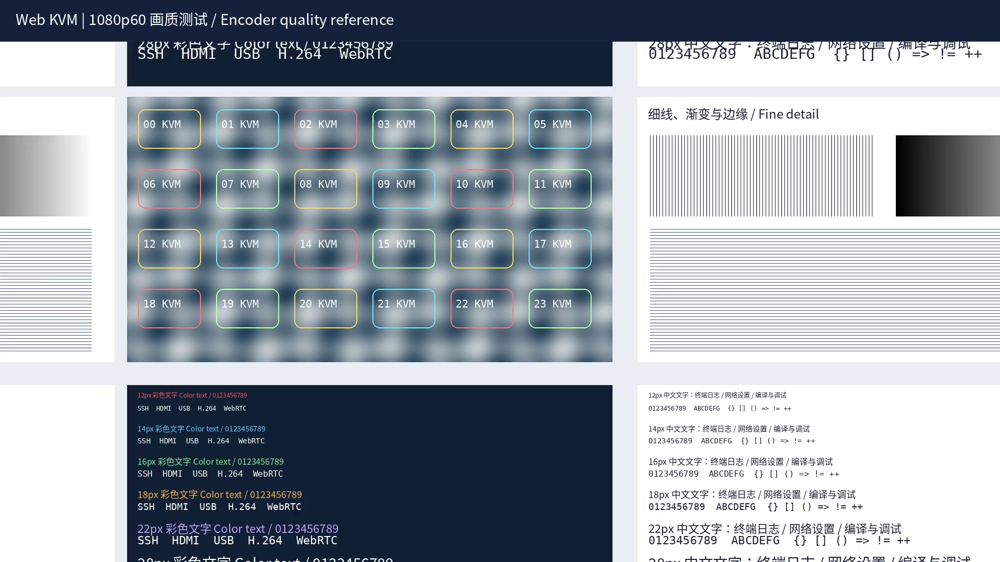

# 测量帧率、码率与延迟

:::info 帧率与延迟是不同指标

浏览器显示 60 FPS，说明近期画面呈现频率接近每秒 60 幅；它不能单独回答鼠标操作多久才出现在屏幕上。

:::

**先确定测量点，再比较参数**，否则很容易把编码速度、播放帧率和网络时延混为一谈。

## 同一条视频链路的不同读数

| 测量位置 | 观察内容 | 能回答的问题 |
| --- | --- | --- |
| 采集服务 | frames、skipped、age、copy/flush、encode | 是否有原始帧积压，工作耗时在哪里 |
| 编码输出 | 完整图像数、字节数 | 编码吞吐和实际视频码率 |
| RTP 接收 | 时间戳间隔、包序号、解码结果 | 网络接收是否连续、采集时间是否保留 |
| 浏览器 | 呈现帧率、停帧状态 | 当前视频是否持续更新 |
| 输入到画面 | 实际输入时刻与对应画面变化 | 端到端交互延迟 |

统计窗口 T 秒内有 N 帧、B 字节，帧率为 N/T，视频负载码率为 8B/T bit/s。网络占用还包含协议头和重传；VBR 会随内容变化，**12 Mbps 配置不表示所有时刻都发送 12 Mbps**。

## 阅读采集日志

在已打开视频的板端执行：

```sh
grep '\[PERF\]' /tmp/kvm_video.log | tail -5
```

本板 12 Mbps 运行记录中的一条统计为：

```text
[PERF] frames=5160 fps=59.99 skipped=0 age_samples=5160 age_avg_ms=0.05 age_max_ms=0.12 work_avg_ms=8.50 copy_ms=0.00 flush_ms=0.00 encode_ms=8.49
```

`skipped` 是主动跳过的旧原始帧；它不是网络丢包计数。`age` 只在时间戳可用且时钟可比时采样，表示出队后的处理起点距该时间戳的间隔。`encode_ms` 包括同步编码调用和输出回调，不是整条链路延迟，也不是单独的芯片运算时间。

## 8、12、16 Mbps 的固定画面对比

在同一 T527 上输入相同的 600 帧 NV12 测试序列：静态文字 120 帧、纵向滚动 240 帧、横纵运动 240 帧。保持 1080p60、High/Level 4.2、QP 20–28、GOP 60，按正序与反序各测一轮。

| 配置码率 | 实际平均码率 | PSNR | SSIM | 两轮平均编码调用耗时 |
| --- | --- | --- | --- | --- |
| 8 Mbps | 4.572 Mbps | 43.07 dB | 0.991257 | 8.55 ms |
| **12 Mbps** | **6.208 Mbps** | **44.87 dB** | **0.995735** | **8.58 ms** |
| 16 Mbps | 6.215 Mbps | 44.87 dB | 0.996261 | 8.59 ms |

PSNR 和 SSIM 比较解码结果与参考图像的接近程度，越高越接近，不能解释为主观画质提升百分比。两轮同档输出散列一致；六轮共 3600 帧完整编码，未出现编码错误。

**12 Mbps 在本测试中提高保真度而几乎不增加调用耗时**，因此作为当前默认配置。16 Mbps 的运动段仍有收益，但整体收益较小。这个结论限于该序列与平台，不能推导为所有画面都已达到最佳画质。

### 查看相同输入的解码细节

下面保留同一运动帧的原尺寸文件。先比较文字边缘和纹理，再区分浏览器图片缩放引入的差异。



图 1：8 Mbps 解码画面。


图 2：12 Mbps 解码画面。

画质比较从 NV12 输入开始，不包含 HDMI 采集和色彩转换的损失。

## 实际 WebRTC 接收结果

12 Mbps 候选版在真实 KVM 链路连续接收 600 帧，RTP 时间间隔推算约 60.002 FPS，未见包序号断档，FFmpeg 完整解码 600 帧；浏览器显示约 60 FPS。视频进程单独重启后能恢复播放。

以上是短时验证。它不代表弱网、所有浏览器或长时间运行都已验收，也不能用 PLI/FIR 的响应时间替代鼠标端到端延迟。

## 设计下一次性能实验

**一次只改变一个因素**，保持源画面、分辨率、网络和测试时长一致。保存源码版本、配置、原始日志和比较图。端到端延迟需要同一时基或外部观测，不能直接相减两台未同步主机的时间戳。

完成后应能解释每个数字测的是哪一段，以及该结果不能证明什么，再进入[延迟与资源优化](../advanced/low-latency.md)。
