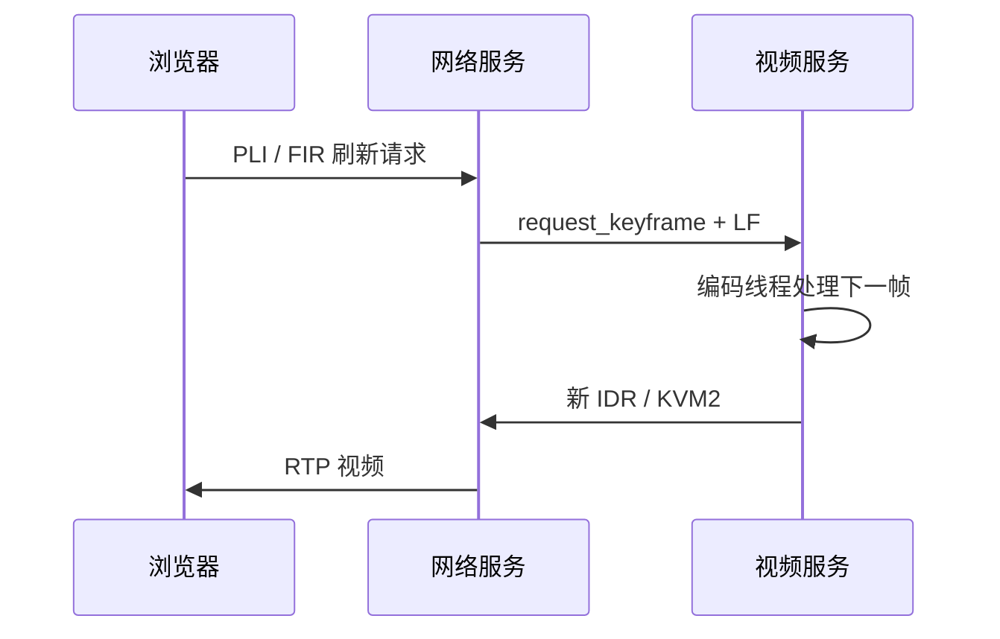

# 控制采集启停与远程操作

视频服务已经连接数据 Socket，不代表已经开始采集。网络服务根据浏览器会话发出控制命令；键鼠则经另一条本地接口交给 USB HID 服务。

## 每一行是一条控制消息

视频控制 Socket 默认是 `/var/run/kvm_ctrl.sock`，两端使用 UTF-8 JSON，**每个对象以换行符 LF 结束**。双方累积读取到完整行后再解析，不能把一次系统调用返回的字节直接当作完整消息。

| action | 消费者的行为 |
| --- | --- |
| `start_video` | 请求建立采集线程和视频流 |
| `stop_video` | 停止采集并释放本次采集资源 |
| `request_keyframe` | 设置请求标志，由编码线程处理下一幅图像 |

```json
{"action":"start_video"}
{"action":"request_keyframe"}
```

上面是两条独立消息，发送时每条都有结尾换行。查看 `kvm_video_demo/main.cpp` 的 `control_thread()` 和 `kvm/internal/app/native.go`，分别追踪命令拆分与事件接收。

## 为什么需要请求关键帧

新浏览器加入、视频服务重连或接收端失去参考帧时，需要新的 IDR。浏览器通过 RTCP 的 PLI/FIR 发出刷新请求，网络服务转成 `request_keyframe`，并按 250 ms 限频，避免持续触发大帧。



图 1：关键帧请求与视频返回。

刷新请求走控制方向，新的图像走视频方向。周期 GOP 仍为 60 帧，请求关键帧并不要求修改 GOP。

## 输入状态和有效画面分别检查

视频服务回传的事件示例：

```json
{"event":"video_input_state","data":{"ready":true,"width":1920,"height":1080,"fps":60.0}}
```

当前 `send_video_state()` 在 buffer 申请与 STREAMON 前发送就绪值，因此**这个事件不能单独证明后续取帧成功**。还应检查持续增长的采集计数、完整视频包和浏览器变化中的画面。

重复进入页面不应创建第二套设备所有者；视频进程重启后应重新连接、同步参数集和请求 IDR。当前样机已经验证视频进程单独重启后恢复播放，网络服务和 HID 服务保持运行。

## 一次按键走哪条接口

```text
浏览器输入 → DataChannel → 网络服务校验与解析
                            ↓ /run/kvm/hid.sock
                       USB HID 服务
                            ↓ /dev/hidg*
                       内核 → 被控设备
```

图 2：键鼠事件传递路径。

视频 Socket 不传递按键。网络服务负责会话和事件，HID 服务负责设备报告。

HID IPC v1 同样按行传输 JSON，单条请求含换行不超过 4096 字节。每次请求等待前一条响应，服务只允许一个输入所有者。以下是协议示例，不应在生产连接旁另开连接抢占输入：

```json
{"v":1,"op":"keyboard","modifier":0,"keys":[4]}
{"v":1,"op":"keyboard","modifier":0,"keys":[]}
{"v":1,"op":"absolute","x":16384,"y":16384,"buttons":0}
{"v":1,"op":"release"}
```

键盘与绝对坐标是完整状态；相对位移和滚轮具有累加效果。**响应丢失后不能盲目重发相对动作**，因为第一次可能已经生效。服务确认成功表示 USB 驱动接受了报告，不等于被控应用已经显示结果。

客户端通过状态请求维持连接；**3 秒没有完整请求、EOF 或异常消息**会终止输入租约并尝试释放按键和按钮。USB 物理断开时，释放报告也可能无法送达，因此还要检查重新枚举后的主机状态。

完成本章时，应能分别指出视频启停、视频刷新与键鼠输入的接口，并通过日志和画面确认各自的结果。
