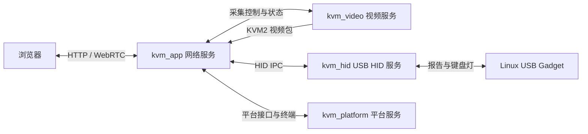

# 理解 Go 服务和网页的系统职责

浏览器已经能看到桌面，但网页、视频设备和 USB 控制器并不由同一个进程直接操作。先区分四个服务，再沿接口追踪一帧视频和一次按键，才能判断更换硬件时应该修改哪一层。

## 四个服务如何协作



图 1：四个服务的协作关系。

视频流与键鼠事件走不同接口；板级设备访问留在对应服务中。

| 服务 | 当前职责 | 不应混淆的操作 |
| --- | --- | --- |
| `kvm_app` | 网页、认证、会话、WebRTC、输入事件和设置业务 | 不直接调用 SoC 编码器，也不直接生成设备侧 USB 报告 |
| `kvm_video` | V4L2 采集、缓冲区导入、硬件编码和视频控制 | 不负责网页登录和浏览器会话仲裁 |
| `kvm_hid` | Gadget 配置、报告写入、键盘灯、断线释放 | 不负责浏览器身份认证 |
| `kvm_platform` | 系统接口、终端桥接、设备身份及平台配置 | 设备能力取决于实现和配置，不能从进程名称推断所有外设可用 |

启动脚本 `run-kvm.sh` 监督这些进程。**进程存在与视频正在采集是两种状态**：浏览器会话通过控制接口启动采集，视频进程本身可以等待命令。

## 从目录定位职责

以下路径相对 SDK 根目录。查网络接口时进入 `kvm/`；查设备报告时进入独立服务目录。

| 入口 | 读取重点 |
| --- | --- |
| `kvm/cmd/kvm/main.go` | 调用网络服务入口 |
| `kvm/internal/app/main.go` | 配置和子系统初始化 |
| `kvm/internal/app/native.go`、`video_stream.go` | 本地视频接口、采集时间戳与 RTP |
| `kvm/internal/app/webrtc.go`、`session.go` | 媒体协商、会话与 DataChannel |
| `kvm/internal/app/hidrpc.go`、`hid_queue.go` | 输入解析和绝对坐标队列策略 |
| `kvm/internal/usbgadget/` | USB HID 服务客户端及协议 |
| `kvm-hid-service/c/gadget.c`、`descriptors.h` | Gadget 对象、HID 报告与描述符 |
| `kvm-platform-service/internal/platform/` | 系统操作和终端实现 |
| `kvm/ui/src/` | 浏览器界面与交互 |

`ui/dist/` 的网页资源通过 `ui/embed.go` 编入 `kvm_app`。**修改前端后，需要重新构建并部署应用**；只把 TSX 源码复制到板子不会改变网页。

## 本地连接与网络连接

Unix Socket 是同一台 Linux 主机上的进程通信接口。当前安装配置中使用：

```text
/tmp/kvm_video_stream.sock   视频数据
/var/run/kvm_ctrl.sock       采集控制
/run/kvm/hid.sock            USB HID 接口
/run/kvm/platform.sock       平台接口
```

视频服务连接网络服务建立的控制、数据监听端点；网络服务作为客户端连接 HID 和平台服务。默认路径由 `platform.env` 中对应环境变量指定。**Socket 文件存在只证明路径建立过**，仍要结合进程、连接日志和业务结果检查。

在板端只读检查：

```sh
pidof kvm_app kvm_video kvm_hid kvm_platform
ls -l /tmp/kvm_video_stream.sock /var/run/kvm_ctrl.sock
ls -l /run/kvm/hid.sock /run/kvm/platform.sock
tail -30 /tmp/kvm-app.log
tail -30 /tmp/kvm-hid.log
```

四个进程均在运行、各接口已建立后，再检查浏览器画面、输入和终端。不要通过手工启动第二个 HID 服务来验证连接，它会与现有服务争夺 Gadget。

## 更换硬件时检查什么

网络服务与前端复用会话和交互代码；**新的硬件需要适配视频后端、Linux 驱动、UDC 选择和平台配置**。接口分离减少了跨层修改，但不代表任意板卡都能直接运行同一组二进制，也不等于已经建立了完整的权限沙箱。

本指南介绍 Go 与前端的职责和接口，不展开完整实现教学。下一章用视频包的字段连接采集时刻与浏览器播放。

<!-- LYNX-LAB:BEGIN -->

## AI 辅助实践闭环

- **稳定步骤**：`t527-kvm-19`
- **学习目标**：理解“理解服务和网页的系统职责”在 T527 Web KVM 链路中的职责，并能用证据解释结果。
- **理解检查**：说明本章输入、输出以及失败时最先检查的证据。
- **学生操作**：在锁定的 Avaota A1 SDK 学习工作区完成“理解服务和网页的系统职责”实验，不直接修改其他板型。
- **工具范围**：`document`
- **风险级别**：`software-safe`
- **预期现象**：命令退出码为 0，并生成带 SHA-256 的结构化证据。

确定性验证：

```bash
cd tutorial-examples/web-kvm
./scripts/verify_architecture.sh
```

必须保存命令退出码、产物摘要和证据来源；模拟结果只能标记为 `simulation`。完成后回答：解释本章结果为何可信，并指出哪些结论仍需要真实硬件。

<details>
<summary>分级提示</summary>

1. 先确认本章输入、输出与证据来源。
2. 检查 ./scripts/verify_architecture.sh 的首个失败阶段。
3. 只对当前步骤相关文件做最小修改，并重新生成一次独立 attempt。
4. 参考已签名课程包中的 solution/19，报告标记为 ASSISTED_PASS。

</details>

<!-- LYNX-LAB:END -->
