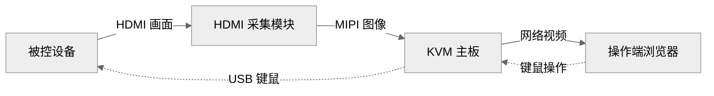

# 认识 Web KVM 与硬件组成

## Web KVM 是什么

**KVM 是 Keyboard（键盘）、Video（视频）、Mouse（鼠标）的缩写。** Web KVM 把设备的画面和键鼠操作带到浏览器：打开网页，就能查看远端桌面，并用自己的键盘和鼠标操作它。

这套方案通过 **HDMI 获取画面，通过 USB 发送键鼠操作**。被控设备不需要安装本项目的远程桌面软件，操作端通过网络访问 KVM 即可。

## 一套 Web KVM 由什么组成

使用时涉及三个部分：**被控设备、KVM 硬件和操作端电脑**。其中，KVM 硬件由采集模块和主板组成。



图 1：Web KVM 的硬件组成。

| 组成部分 | 作用 |
| --- | --- |
| **被控设备** | 提供 HDMI 画面，接收 USB 键鼠输入，例如电脑或带图形桌面的开发板 |
| **HDMI 采集模块** | 接收被控设备的 HDMI 信号，转换为主板能够采集的 MIPI 图像 |
| **KVM 主板** | 采集和编码图像，通过网络提供网页，并模拟 USB 键盘和鼠标 |
| **操作端电脑** | 用浏览器查看远端画面，发送键盘和鼠标操作 |

## 本方案使用的硬件

本方案以 **T527 主板**和 **LT6911 系列 HDMI 转 MIPI 模块**为参考硬件。主板负责图像处理与网络访问，采集模块负责接收 HDMI 画面。

| 硬件与接口 | 在方案中的用途 |
| --- | --- |
| T527 主板 | 运行 KVM 系统，完成视频采集、硬件编码与网络通信 |
| HDMI 采集模块 | HDMI 输入接被控设备，MIPI 输出接主板 |
| 主板 FPC2 | 连接采集模块的 MIPI 排线 |
| 主板 H1 排针 | 连接采集模块的控制线 |
| **主板 OTG 口** | 工作在 **USB Device 模式**，通过数据线接被控设备的 **USB Host 口**，模拟键盘和鼠标 |
| 网络接口 | 连接操作端电脑所在的网络 |

实际搭建还需要 HDMI 线、USB 数据线、模块排线与控制线，以及主板配套电源。具体连接方法见下一章[接线与供电检查](./wiring-firmware.md)。

<!-- LYNX-LAB:BEGIN -->

## AI 辅助实践闭环

- **稳定步骤**：`t527-kvm-01`
- **学习目标**：理解“认识 Web KVM 与硬件组成”在 T527 Web KVM 链路中的职责，并能用证据解释结果。
- **理解检查**：说明本章输入、输出以及失败时最先检查的证据。
- **学生操作**：在锁定的 Avaota A1 SDK 学习工作区完成“认识 Web KVM 与硬件组成”实验，不直接修改其他板型。
- **工具范围**：`hardware`
- **风险级别**：`software-safe`
- **预期现象**：命令退出码为 0，并生成带 SHA-256 的结构化证据。

确定性验证：

```bash
cd tutorial-examples/web-kvm
./scripts/verify_architecture.sh
```

必须保存命令退出码、产物摘要和证据来源；模拟结果只能标记为 `simulation`。完成后回答：解释本章结果为何可信，并指出哪些结论仍需要真实硬件。

<details>
<summary>分级提示</summary>

1. 先确认本章输入、输出与证据来源。
2. 检查 ./scripts/verify_architecture.sh 的首个失败阶段。
3. 只对当前步骤相关文件做最小修改，并重新生成一次独立 attempt。
4. 参考已签名课程包中的 solution/01，报告标记为 ASSISTED_PASS。

</details>

<!-- LYNX-LAB:END -->
