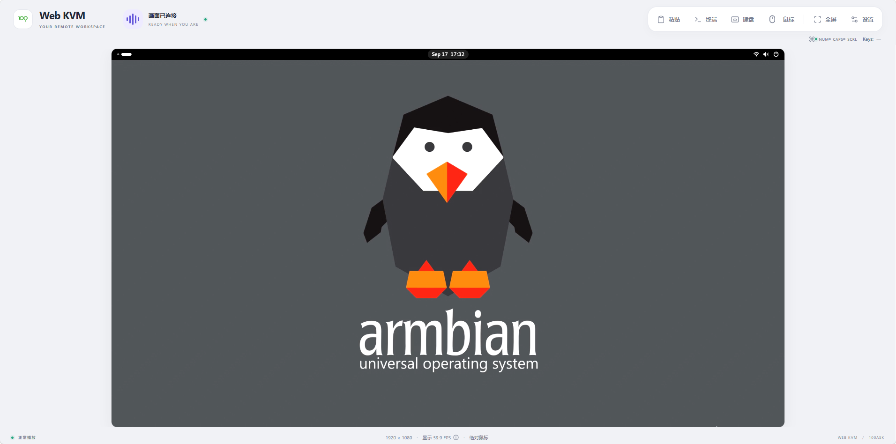

# 使用参考镜像运行完整 KVM

改驱动之前，先保留一套能够运行的系统及其版本记录。这样出现无画面时，才能区分新代码引入的问题与接线、源设备输出或旧文件混用。

:::info 镜像与恢复资料

目前本文已核对现有样机和源码，尚未发布带校验值的整机参考镜像，也未验证统一恢复流程。已有配套镜像的读者按对应板卡说明烧录；没有镜像时先保留现有运行系统，不使用未知分区上的 `dd` 命令试写。

:::

## 核对完整运行所需的文件

```text
启动存储
├─ 启动程序、Linux 内核、板级 DTB
├─ 根文件系统和 /lib/modules/<内核版本>/
└─ /userdata/100ask_kvm/
   ├─ bin/kvm_app       网络服务与内嵌网页
   ├─ bin/kvm_video     采集与编码
   ├─ bin/kvm_hid       USB HID 服务
   ├─ bin/kvm_platform  平台服务
   ├─ bin/kvm-run       进程运行与日志工具
   ├─ platform.env     平台环境配置
   ├─ board.json       系统设备配置
   └─ run-kvm.sh       进程监督
```

模块内部的 HDMI 转换固件是另一份软件，不能用重烧主板镜像代替它。**内核、DTB、驱动模块和用户态库也必须成套匹配**。

板端执行以下只读命令，保存结果：

```sh
uname -r
ls -l /userdata/100ask_kvm/bin
pidof kvm_app kvm_video kvm_hid kvm_platform
ls /dev/video* /dev/hidg* /sys/class/udc
ls -l /tmp/kvm_video_stream.sock /var/run/kvm_ctrl.sock
ls -l /run/kvm/hid.sock /run/kvm/platform.sock
tail -30 /tmp/kvm_video.log
```

实际核对样机运行四个独立服务，内核为 5.15.147。视频日志中的编码调用证明编码路径正在执行；它不能独立证明浏览器最终显示正常。

## 浏览器验收

下面是当前样机通过浏览器收到的实际 HDMI 桌面。先观察中间的视频区域，再区分上方的网页控制栏：**桌面内容来自被控设备，控制栏由 KVM 网页提供**。



图 1：Web KVM 运行界面。

当前功能为视频、键鼠、终端与基础设置。

1. 在同一网络中访问 KVM 的实际 IP 地址，确认菜单能显示。
2. 被控设备接好 HDMI，确认画面中的时钟、鼠标或窗口持续变化，排除静止的旧画面。
3. 在被控设备打开空白文本编辑器，再测试普通字母与鼠标移动。
4. 记录输入分辨率、线缆、模块固件、主板版本和是否进行了冷启动。

不要用有破坏性的组合键测试键盘。当前基础链路以**固定 1080p60、12 Mbps VBR** 为范围，热插拔与动态分辨率需要各自验证。

## 为后续修改保留可恢复状态

在开发主机保存待部署文件的校验值：

```bash
sha256sum kvm_video_demo/kvm_video
git -C kvm rev-parse HEAD
git -C bsp rev-parse HEAD
git -C device/config/chips/t527 rev-parse HEAD
git -C device/config/chips/t527 diff -- configs/demo_linux_aiot/linux-5.15/board.dts
```

提交号不包含未提交的设备树修改，也不覆盖独立的 `kvm_video_demo`。**同时保存补丁和散列值**，才能描述实际运行版本。

恢复包至少要包含镜像、校验文件、板卡版本、烧录入口说明、串口参数和已测功能清单。执行烧录前备份需要保留的配置与数据；恢复是否成功，以重新上电后的视频和键鼠测试为准。
