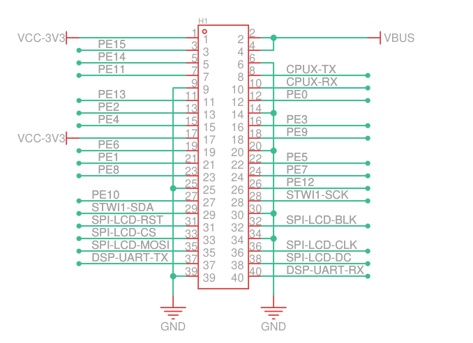

# 通过 H1 串口进入 T527

接好采集模块后，T527 还没有保存家中或实验室的 WiFi 信息，需要先通过串口进入系统。串口直接连接电脑和主板，不依赖网络；下一课就在这个终端里设置 WiFi。

准备一个支持 **3.3V TTL 信号**的 USB 转串口模块和三根杜邦线。模块品牌可以不同，接线按 TXD、RXD、GND 的标识判断。主板仍使用配套电源供电。

## H1 上的三根调试线

在主板断电时找到 H1 的 1 脚标识，再按物理脚号定位 6、8、10 脚。下图是原理图符号，实际排针方向以板上标识为准。



图 1：H1 的 CPUX 调试串口，摘自 Avaota Pi A 主板原理图，REV 1.0，第 9 页。[查看原理图](/resources/kvm/mainboard-schematic.pdf)。

| T527 主板 H1 | 信号方向（相对主板） | USB 转 TTL 模块 |
| --- | --- | --- |
| **8 / CPUX-TX** | 主板发送 | **RXD** |
| **10 / CPUX-RX** | 主板接收 | **TXD** |
| **6 / GND** | 共地 | **GND** |

TX 接对端 RX：主板发送的日志由模块接收，电脑输入的命令由模块发送给主板。不要误接 H1 的 DSP-UART-TX/RX，那是另一组信号。

这里只接三根信号线，**模块的 VCC、5V、3.3V 供电脚都不接主板**。模块若有电压跳帽，要确认它设置的是串口信号电平；只改变供电脚电压的跳帽，不一定会改变 TXD 电平。不要使用 RS-232 电平转换器代替 TTL 模块。

采集模块与 USB 转 TTL 模块都需要和主板共地。若 H1 第 6 脚已经占用，使用已经核对过的主板 GND 焊盘或合适的分线共地；不要为了接串口断开采集模块的地线。

## 选择电脑上的串口

将 USB 转 TTL 模块接到 Windows 电脑，打开“设备管理器 → 端口（COM 和 LPT）”，找到插入模块后新增的设备。未出现端口或有黄色感叹号时，按模块厂商说明安装对应驱动。

下面是一次连接实例，端口号为 COM4：


图 2：CH344 的 B 通道被分配为 COM4。其他模块或另一台电脑的端口号可能不同。

CH344 会出现多个串口，选择与实际接线通道对应的端口。串口终端可以使用现有工具，只要能设置以下参数：

| 参数 | 设置 |
| --- | --- |
| 端口 | 设备管理器中确认的 COM 口 |
| 波特率 | **115200** |
| 数据位 | **8** |
| 校验位 | **None / 无** |
| 停止位 | **1** |
| 硬件流控 RTS/CTS | **关闭** |
| 软件流控 XON/XOFF | **关闭** |
| 本地回显 | 关闭 |

一个 COM 口同时只由一个程序打开。提示端口占用时，先关闭另一串口终端；模块接在 Windows 上使用时，不要又将该 USB 设备交给 Ubuntu 虚拟机。

## 出现提示符并执行命令

打开串口后给主板上电，观察启动日志。如果主板已经运行，直接按 Enter，无需为了连接终端重新启动。

当前配套系统会进入 `#` 提示符，可直接输入以下命令；代码块不包含提示符，不需要手动输入 `#`：

```sh
uname -r
uname -m
cat /proc/device-tree/model
echo
```

配套样机的实际结果是：

```text
5.15.147
aarch64
sun55iw3
```

能看到日志只证明主板到电脑的接收方向正常。输入命令后能得到返回结果，才同时确认 TX、RX 两个方向都已连通。

当前镜像的串口直接启动 shell；其他镜像若出现 `login:`，使用该镜像提供的账号，不要套用 Ubuntu 虚拟机的登录信息。

| 现象 | 先检查什么 |
| --- | --- |
| 打不开串口 | COM 号、驱动、是否被另一程序或虚拟机占用 |
| 完全没有输出 | 主板供电、模块 RXD 是否接 CPUX-TX、共地是否可靠 |
| 能看日志，输入无响应 | 模块 TXD 是否接 CPUX-RX、流控是否关闭、发送 Enter 是否为回车 |
| 连续乱码 | 115200 / 8N1、信号电平、接线接触与共地 |
| 每个字符重复两次 | 关闭终端的本地回显 |

保留这个串口终端，继续[连接 WiFi 与确认网络](./wifi-network.md)。
