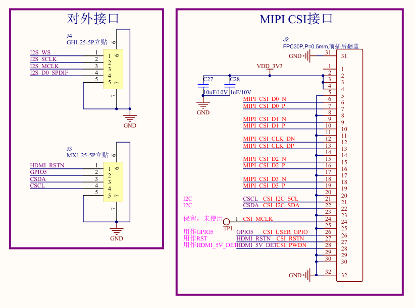

# 连接采集模块与主板

HDMI 画面与 USB 键鼠经过两条不同的链路。连接采集模块时，还要区分传输图像的 MIPI 排线、访问模块的 I²C 控制线，以及供电和复位信号；只接上控制线，不能建立完整的视频通路。



图 1：模块 J2 与 J3 接口。

## J3 的五根线

以下编号来自原理图的连接器编号，**不能从排线颜色或照片左右推断第 1 脚**。先找到连接器的 1 脚标识。

| 模块 J3 | 网络名 | 用途 |
| --- | --- | --- |
| 1 | HDMI_RSTN | 低有效复位，高电平解除复位 |
| 2 | GPIO5 | 模块事件输出，可供驱动检测输入变化 |
| 3 | CSDA | I²C 数据 |
| 4 | CSCL | I²C 时钟 |
| 5 | GND | 信号与供电参考地 |

**HDMI_RSTN 是复位输入，给它接 3.3V 不等于给模块供电。** 模块主电源是 J2 第 2、3、4 脚的 VDD_3V3 网络。不要把 HDMI_5V 或其他 5V 电源接到该网络。

## 连接主板的视频与电源

模块 J2 与主板 FPC2 的主要电气对应如下。排线同面/异面、插接方向以及控制脚是否屏蔽，仍需对照实际套件确认。

| 信号 | 模块 J2 | 主板 FPC2 |
| --- | --- | --- |
| VDD_3V3 | 2 / 3 / 4 | 2 / 3 / 4 |
| D0 N/P | 6 / 7 | 6 / 7 |
| D1 N/P | 9 / 10 | 9 / 10 |
| CLK N/P | 12 / 13 | 12 / 13 |
| D2 N/P | 15 / 16 | 15 / 16 |
| D3 N/P | 18 / 19 | 18 / 19 |

四条数据 Lane 加一条时钟差分对承担视频传输。**排针上的 I²C 不能替代这些信号**。

## 将 J3 接到主板 H1

先在下图中找到 **H1 的 1、3、6、15、16 脚**。表中的数字是连接器物理脚号，PE15、PE4、PE3 则是主板 GPIO 名称。


图 2：主板 H1 排针。

**断电后按下表连接五根控制线：**

| 模块 J3 引脚 | 信号 | T527 主板 H1 引脚 | 作用 |
| --- | --- | --- | --- |
| **1** | HDMI_RSTN | **1 / VCC-3V3** | 保持高电平，解除模块复位 |
| **2** | GPIO5 | **3 / PE15** | 接收 HDMI 输入变化事件 |
| **3** | CSDA | **15 / PE4** | I²C 数据，使用 TWI3 |
| **4** | CSCL | **16 / PE3** | I²C 时钟，使用 TWI3 |
| **5** | GND | **6 / GND** | 模块与主板共地 |

:::tip 复位与检测线的接法

**RSTN 接 3.3V，GPIO5 接 PE15。H1 第 5 脚 PE14 不接这两根线。**

RSTN 为低有效复位输入，固定接 3.3V 后保持解除复位；配套驱动不再通过 GPIO 拉低它。GPIO5 是模块的事件输出，主板通过 PE15 接收通知，再确认输入状态。它与 HDMI 插座侧的 HPD 信号不是同一根线。

:::

另外，J2 的 CSCL、CSDA、GPIO5、RSTN 与 J3 是同名网络，完整 FPC 连接可能同时接到主板 PK 引脚和 H1 的 PE 引脚。必须确认另一侧引脚没有输出冲突；改设备树并不会断开铜线。

## 上电后的检查顺序

1. 断电核对 FPC 方向、供电网络和共地；测量电阻/通断只能在断电状态进行。
2. 上电测模块 VDD_3V3 与复位电平。表笔地夹优先接已确认的 GND 焊盘；USB 金属外壳是否直连信号地需先确认，不能按外形推定。
3. 被控设备 **HDMI OUT → 模块 HDMI IN**，将源设备输出设为 **1920×1080、60 Hz**。
4. 使用 USB 数据线将 **T527 主板的 OTG 口（Device 模式）** 接到 **被控设备的 USB Host 口**；网络接操作端所在网络。
5. 使用配套 KVM 系统打开网页，确认桌面持续更新，并测试键盘输入与鼠标移动。

## 检查 HDMI 拔插后的画面

使用已包含 HDMI 检测驱动和自动恢复功能的配套系统，保持浏览器页面打开：

| 操作 | 网页上的预期表现 |
| --- | --- |
| HDMI 保持连接 | 桌面持续更新 |
| 拔掉模块的 HDMI 线，等待约 5 秒 | 显示 **“没有检测到 HDMI 画面”** |
| 重新插回 HDMI | **无需刷新网页，自动恢复画面** |

**只停在最后一帧，不能作为插拔检测正常的判断依据。** 拔线后应有无信号提示，插回后应重新显示持续更新的桌面。

若没有上述变化，先核对 J3 第 2 脚是否接到 H1 第 3 脚 PE15，再核对系统中的驱动与采集程序是否包含热插拔支持。详细处理流程见 [HDMI 热插拔](../advanced/hdmi-hotplug.md)。

完成硬件接线后，进入[通过 H1 串口进入 T527](./serial-console.md)，先建立不依赖网络的板端登录路径。

<!-- LYNX-LAB:BEGIN -->

## AI 辅助实践闭环

- **稳定步骤**：`t527-kvm-02`
- **学习目标**：理解“连接采集模块与主板”在 T527 Web KVM 链路中的职责，并能用证据解释结果。
- **理解检查**：说明本章输入、输出以及失败时最先检查的证据。
- **学生操作**：在锁定的 Avaota A1 SDK 学习工作区完成“连接采集模块与主板”实验，不直接修改其他板型。
- **工具范围**：`hardware`
- **风险级别**：`hardware-confirmation`
- **预期现象**：软件合同通过；接入实机后获得对应设备观测。

确定性验证：

```bash
cd tutorial-examples/web-kvm
./scripts/verify_wiring_contract.sh
```

必须保存命令退出码、产物摘要和证据来源；模拟结果只能标记为 `simulation`。完成后回答：解释本章结果为何可信，并指出哪些结论仍需要真实硬件。

<details>
<summary>分级提示</summary>

1. 先确认本章输入、输出与证据来源。
2. 检查 ./scripts/verify_wiring_contract.sh 的首个失败阶段。
3. 只对当前步骤相关文件做最小修改，并重新生成一次独立 attempt。
4. 参考已签名课程包中的 solution/02，报告标记为 ASSISTED_PASS。

</details>

<!-- LYNX-LAB:END -->
