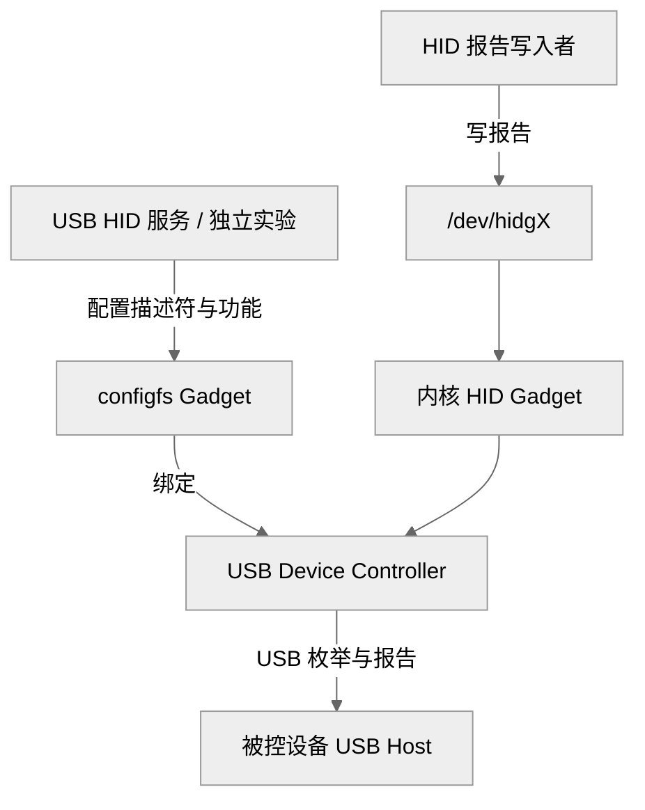

# 让 T527 枚举成 USB HID 设备

KVM 接到被控设备的 USB 线上时，**T527 扮演的是 USB 设备**。**被控设备是主机**，负责枚举键盘与鼠标。这与把普通 USB 键盘插到 T527 的 Host 口上相反。

## Linux、configfs 和应用的分工



图 1：USB 键鼠分工。

USB HID 服务管理配置和报告，内核完成 USB 枚举与传输。

configfs 是内核提供的配置文件系统。创建目录和写属性会建立内核对象，不是创建普通文本配置后等服务读取。UDC 是 USB Device Controller；将其名称写入 Gadget 的 `UDC` 属性，才把功能集合绑定到硬件控制器。[Linux configfs Gadget 文档](https://docs.kernel.org/usb/gadget_configfs.html)给出了这些对象的对应关系。

## 检查现有 KVM 配置

在板端执行只读命令：

```sh
ls /sys/class/udc
cat /sys/kernel/config/usb_gadget/kvm/UDC
ls /sys/kernel/config/usb_gadget/kvm/functions
ls -l /sys/kernel/config/usb_gadget/kvm/configs/c.1
ls -l /dev/hidg*
```

当前样机控制器名为 `4100000.udc-controller`。`kvm-hid-service/c/descriptors.h` 定义键盘、绝对鼠标和相对鼠标描述符；`gadget.c` 创建 `hid.usb0`、`hid.usb1`、`hid.usb2`。服务根据 function 的 `dev` 属性和 `/sys/dev/char` 发现对应节点，以下是当前板上的映射。

| 功能 | report_length | 应用打开的节点 |
| --- | --- | --- |
| 键盘 | 8 | `/dev/hidg0` |
| 绝对鼠标 | 6 | `/dev/hidg1` |
| 相对鼠标 | 4 | `/dev/hidg2` |

换配置或注册顺序后，节点编号不能靠猜测。**`report_desc` 决定字段含义，`report_length` 限制报告长度**，二者需要一致。

## 独立键盘配置实验

下面实验会让主机重新枚举 USB，应在串口或网络终端中操作。先通过 `/etc/init.d/S99kvm stop` 停止 KVM，并停止 ADB 的 USB 管理服务，并确认所有现有 Gadget 的 `UDC` 均为空；停止 adbd 进程本身不保证解绑。ADB 冲突处理见[USB 异常](./usb-recovery.md)。

确认 configfs 已挂载、`usb_gadget` 目录存在，且内核提供 HID function。将配套 [keyboard-report-desc.bin](/examples/kvm/keyboard-report-desc.bin) 下载到板端当前实验目录；它与当前项目 `descriptors.h` 的 `descriptor_0` 一致，后续报告必须与此描述符匹配。

以下命令需要预先设置 `VID`、`PID` 为套件提供的 USB 标识，设置 `UDC` 为实际控制器名称。它们分别决定主机识别到的设备身份和本次使用的硬件控制器。

```sh
: "${VID:?请设置套件 USB VID}"
: "${PID:?请设置套件 USB PID}"
: "${UDC:?请设置实际 UDC 名称}"
test -r keyboard-report-desc.bin || exit 1
G=/sys/kernel/config/usb_gadget/kvm_tutorial
test ! -e "$G" || exit 1
mkdir "$G" || exit 1
printf '%s' "$VID" > "$G/idVendor"
printf '%s' "$PID" > "$G/idProduct"
mkdir -p "$G/strings/0x409"
printf '%s' 'KVM tutorial' > "$G/strings/0x409/product"
mkdir -p "$G/configs/c.1/strings/0x409"
printf '%s' 'Keyboard' > "$G/configs/c.1/strings/0x409/configuration"
mkdir "$G/functions/hid.usb0"
printf '1' > "$G/functions/hid.usb0/protocol"
printf '1' > "$G/functions/hid.usb0/subclass"
printf '8' > "$G/functions/hid.usb0/report_length"
cat keyboard-report-desc.bin > "$G/functions/hid.usb0/report_desc"
ln -s "$G/functions/hid.usb0" "$G/configs/c.1/hid.usb0"
printf '%s' "$UDC" > "$G/UDC"
```

这些是逐步实验命令；每步出错即停止检查，不要忽略错误继续绑定。**先创建 function，再将它链接到 configuration，最后绑定 UDC**。创建 function 并不自动把它加入主机看到的配置。

本段尚未在当前样机上替换既有 Gadget 实测。成功标准是主机实际枚举出键盘，并在下一章收到报告；仅出现 `/dev/hidg0` 不够。实验结束先向本实验 `UDC` 写入换行解绑，然后按链接、function、配置、字符串、Gadget 的逆序用 `rm`/`rmdir` 清理自己创建的对象，不递归删除其他 Gadget。

<!-- LYNX-LAB:BEGIN -->

## AI 辅助实践闭环

- **稳定步骤**：`t527-kvm-15`
- **学习目标**：理解“让 T527 枚举成 USB HID 设备”在 T527 Web KVM 链路中的职责，并能用证据解释结果。
- **理解检查**：说明本章输入、输出以及失败时最先检查的证据。
- **学生操作**：在锁定的 Avaota A1 SDK 学习工作区完成“让 T527 枚举成 USB HID 设备”实验，不直接修改其他板型。
- **工具范围**：`terminal`
- **风险级别**：`software-safe`
- **预期现象**：命令退出码为 0，并生成带 SHA-256 的结构化证据。

确定性验证：

```bash
cd tutorial-examples/web-kvm
./scripts/run_simulation.sh gadget
```

必须保存命令退出码、产物摘要和证据来源；模拟结果只能标记为 `simulation`。完成后回答：解释本章结果为何可信，并指出哪些结论仍需要真实硬件。

<details>
<summary>分级提示</summary>

1. 先确认本章输入、输出与证据来源。
2. 检查 ./scripts/run_simulation.sh gadget 的首个失败阶段。
3. 只对当前步骤相关文件做最小修改，并重新生成一次独立 attempt。
4. 参考已签名课程包中的 solution/15，报告标记为 ASSISTED_PASS。

</details>

<!-- LYNX-LAB:END -->
